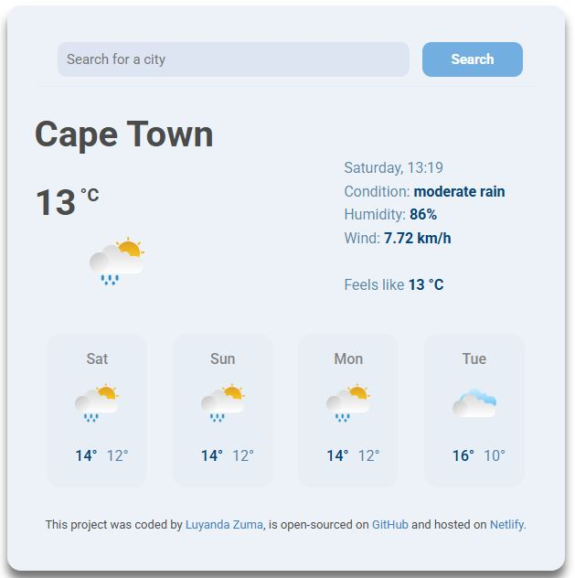

# weather-app-v2

Project Name: Weather - Isibiko sezulu
<a href="https://weatherisibikosezulu.netlify.app/" target="_blank">Live demo</a> of Weather - Isibiko sezulu

# Overview

Weather - Isibiko sezulu is a weather web app that provides real-time weather updates for cities around the world. The app fetches live data from a weather API and displays current weather condistions in a clean and user-friendly interface.

# Preview

# Tech Stack

<ul>
<li>HTML5</li>
<li>CSS3</li>
<li>JavaScript (ES6+)</li>
<li>Weather API - shecodes.io weather API</li>
</ul>

# Features

Search weather by city name.
View live temperature, weather conditions, wind speed, and humidity.
Error handling for empty searches.
Weather icons for visual clarity.
Clean and minimal user interface.

# How I Built It

Created the basic HTML structure and input form.
Designed the layout using CSS Flexbox.
Used JavaScript to handle search input, make API calls to fetch weather data, analyse and display
weather details as well as a weather forecast on the page.
Styled weather details based on the data using icon that matches the temperature of the day.

# What I Learned

How to fetch and work with API data in real-time.
DOM manipulation and dynamic content rendering.
Responsive design using CSS media queries.
Writing clean JavaScript code.
Handling user input and errors gracefully.
